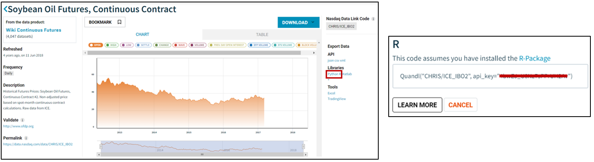

```{r setup, include=FALSE}
knitr::opts_chunk$set(echo = TRUE)
```

## Data Access

This case study uses prices of soybean oil and diesel fuel from [Nasdaq](https://data.nasdaq.com/). You will need to create an account to download the data in R (or Python) using the [`{Quandl}`](https://data.nasdaq.com/tools/r) package. After you create your account, you can simply search for the price series of interest (e.g., Soybean Oil Futures or U.S. No. 2 Diesel Retail Prices) and click the R (or Python) link on the right hand side of the window below Libraries. A pop up will appear containing the code for you to copy and paste into your software, as shown in Figure \@ref(fig:nasdaq).

```{r nasdaq, echo=FALSE, fig.cap = "Nasdaq interface", fig.align='center', out.width = "80%"}

```


## Loading the data into R

We first load the packages we will use to analyze the data. 

```{r}
pacman::p_load(tidyverse, lubridate, stringr, Quandl, urca, xts, forecast)
```

Then we will load the data using the R codes we have copied from Nasdaq. 

```{r, eval = F}
soybeans <- Quandl("CHRIS/ICE_IBO2")
diesel <- Quandl("EIA/PET_EMD_EPD2D_PTE_NUS_DPG_W")
```

A quick look at the data shows that the soybean oil price is reported for each working day, excluding holidays from May 2012 to June 2018, and the diesel price is reported every Monday. There are different techniques proposed in the literature to work with multiple time series data that are sampled at different frequencies. To keep things simple, we will use `Quandl`'s weekly function to aggregate the daily data to weekly average prices for the soybeans series. Because the soybean weekly dates will land on Sundays, we will add one day so that the dates for the two price series will be on Mondays. 

```{r}
# get soybeans data in weekly format
soybeans <- Quandl("CHRIS/ICE_IBO2", collapse = "weekly")

# add 1 day to date, so dates will be on Monday instead of Sunday
soybeans$Date <- soybeans$Date + 1 

# get diesel data for the similar time period
diesel <- Quandl("EIA/PET_EMD_EPD2D_PTE_NUS_DPG_W", start_date = "2012-05-13", end_date = "2018-06-17")
```

We have to tell R that we are working with time series data. There are [multiple packages](https://faculty.washington.edu/ezivot/econ424/Working%20with%20Time%20Series%20Data%20in%20R.pdf) to handle time series data in R. In our labs, we will use the `{xts}` package. With this package, we will use the `xts` function to convert the dataframe to an xts object. The syntax is `xts(data, order.by = date_index)`.  

```{r}
ts_soy <- xts(soybeans$Settle, order.by = soybeans$Date)
ts_diesel <- xts(diesel$Value, order.by = diesel$Date)
```

Now that these two xts objects have the same dates, we can use the `xts.merge()` function. 

```{r}
soydiesel <- merge.xts(ts_soy, ts_diesel)
colnames(soydiesel) <- c("p_soy", "p_diesel")
head(soydiesel)
```

# Working with time series data

When working with time series data, the first step is to test for stationarity. If we run OLS with non-stationariy data, we get spurious results. An exception to this rule is when two data series are cointegrated. Two non-stationarity series are cointegrated if there exists a linear combination of the two series that is stationarity. This linear combination is called the cointegrating vector. 

This case study tests the cointegration for soybean oil and diesel because the literature suggests there is a long run price linkage between these two variables (read [here](https://www.ideals.illinois.edu/bitstream/handle/2142/45274/Hala_Zahran.pdf?sequence=1)

## Testing for Stationarity

We use the `ur.df()` function of the `{urca}` package to conduct the Dickey-Fuller Unit Root test. 
```{r}
df_soy <- ur.df(soydiesel$p_soy, type = c("trend"), lags = 0)

df_diesel <- ur.df(soydiesel$p_diesel, type = c("trend"), lags = 0)

summary(df_soy)
summary(df_diesel)
```

In the Dickey-Fuller test of soybean oil prices, we observe that the t-statistic is `r round(summary(df_soy)@teststat[1], 2)`. We compare this number to the tau3 critical values of [`r summary(df_soy)@cval[1,]`] at the 1%, 5%, and 10% level, respectively. Because the t-statistic is larger than all of the critical values, we fail to reject the null hypothesis of a unit root at any significance level. 

In the Dickey-Fuller test of diesel prices, the t-statistic is `r round(summary(df_diesel)@teststat[1], 2)`. We compare this number to the tau3 critical values of [`r summary(df_diesel)@cval[1,]`] at the 1%, 5%, and 10% level, respectively. Because the t-statistic is larger than all of the critical values, we fail to reject the null hypothesis of a unit root at any significance level. 

Based from the Dickey-Fuller tests, we conclude that both soybean oil and diesel prices are non-stationary. 

*Here's a useful link that explains how to interpret the [results](https://stats.stackexchange.com/questions/24072/interpreting-rs-ur-df-dickey-fuller-unit-root-test-results).*

## Testing for I(1)

We now test whether the first difference of each series is stationary. We can only proceed with a test of cointegration if the non-stationary data series are both integrated of the same order. 

We use the `diff.xts()` function to take the first difference. We add in `na.pad = F` to drop the first row, which will be `NA`. The `ur.df()` function only works if the data does not include any NAs. 

```{r}
df_soy_diff <- ur.df(diff.xts(soydiesel$p_soy, na.pad = F), type = c("trend"), lags = 0)

df_diesel_diff <- ur.df(diff.xts(soydiesel$p_diesel, na.pad = F), type = c("trend"), lags = 0)

summary(df_soy_diff)
summary(df_diesel_diff)
```

The Dickey-Fuller test on the first difference of soybean oil and diesel prices show that the test statistics are `round(summary(df_soy_diff)@teststat[1], 2)` and `round(summary(df_diesel_diff)@teststat[1], 2)`, respectively. Comparing the test statistics to the critical values of [`r summary(df_soy_diff)@cval[1,]`] at the 1%, 5%, and 10%, respectively. We reject the null hypothesis of a unit root for both price series. We therefore conclude that both series are integrated of order 1. We can now proceed with the test for cointegration.


